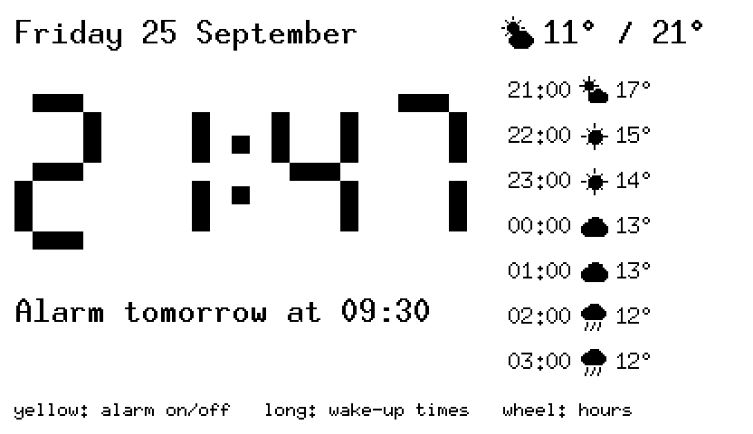
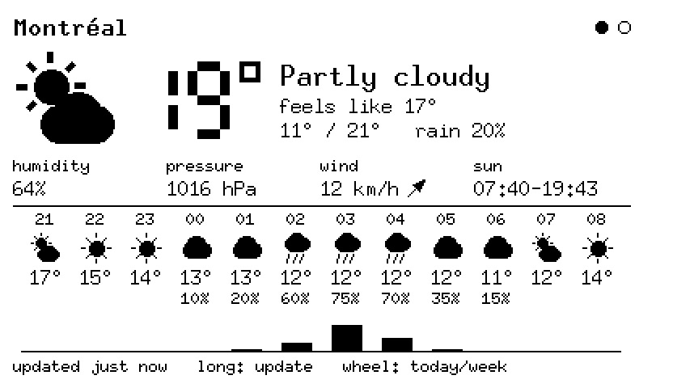
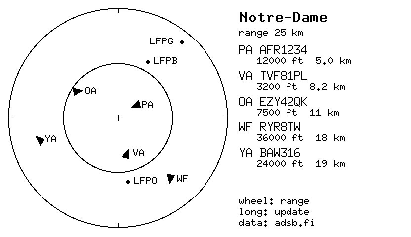
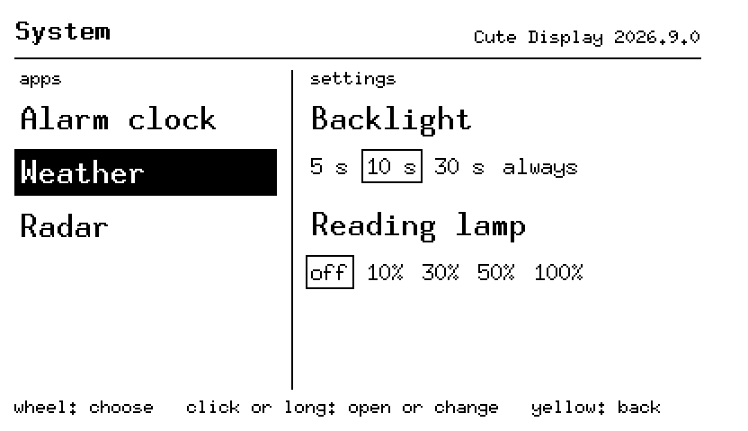

# Cute Display

Another firmware for the [Habity bedside clock](https://habity.design/products/bedside-clock):
an alarm clock with the weather and the planes overhead, on its e-paper screen. It goes
beside Habity's own firmware, which one command brings back.

| | |
| --- | --- |
|  |  |
|  |  |

## Apps

- [Alarm clock](docs/apps/alarm/README.md): the time, a wake-up time per day, a sunrise
  before it.
- [Weather](docs/apps/weather/README.md): today, the coming hours, the week.
- [Radar](docs/apps/radar/README.md): the aircraft around you.
- [System](docs/apps/system/README.md): the other apps, and the settings.

## Install

- [Installing](docs/install.md): what you need, then four commands; going back to
  Habity's firmware.
- [Troubleshooting](docs/troubleshooting.md).

## Further

- [Changelog](CHANGELOG.md): what each release changes.
- [Notice](NOTICE.md): license, data sources, not affiliated with Habity.
- [Development](docs/development.md): building, flashing, and how the project is made.
